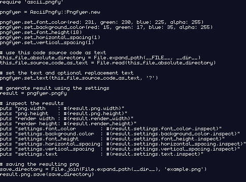

#### What is AsciiPngfy

---

AsciiPngfy is a Ruby Gem that enables you to render ASCII character text into a PNG image using a 5x9 monospaced font. 

The Gem can be configured to change the result using the following settings:

- **font-color**: RGBA color for the font pixels
- **image background-color**: RGBA color for the image background
- **font height**: determines the target render size and does not influence the actual generated image
- **horizontal-spacing**: number of empty horizontal character cells between characters
- **vertical-spacing**: number of empty vertical character cells between lines
- **text and replacement text**: text to render into the generated image and optional replacement text that replaces unsupported characters in the text


Here an example of AsciiPngfy in action, where the source code itself is used as text:

```ruby
require 'ascii_pngfy'

pngfyer = AsciiPngfy::Pngfyer.new

pngfyer.set_font_color(red: 231, green: 230, blue: 225, alpha: 255)
pngfyer.set_background_color(red: 15, green: 17, blue: 35, alpha: 255)
pngfyer.set_font_height(18)
pngfyer.set_horizontal_spacing(1)
pngfyer.set_vertical_spacing(1)

# use this code source code as text
this_file_absolute_directory = File.expand_path(__FILE__, __dir__)
this_file_source_code_as_text = File.read(this_file_absolute_directory)

# set the text and optional replacement text
pngfyer.set_text(this_file_source_code_as_text, '?')

# generate result using the settings
result = pngfyer.pngfy

# inspect the results
puts "png.width    : #{result.png.width}"
puts "png.height   : #{result.png.height}"
puts "render_width : #{result.render_width}"
puts "render_height: #{result.render_height}"
puts "settings.font_color        : #{result.settings.font_color.inspect}"
puts "settings.background_color  : #{result.settings.background_color.inspect}"
puts "settings.font_height       : #{result.settings.font_height.inspect}"
puts "settings.horizontal_spacing: #{result.settings.horizontal_spacing.inspect}"
puts "settings.vertical_spacing  : #{result.settings.vertical_spacing.inspect}"
puts "settings.text              : #{result.settings.text.inspect}"

# saving the resulting png
save_directory = File.join(File.expand_path(__dir__), 'example.png')
result.png.save(save_directory)
```


Generated `result.png`:




#### Inspiration and Credits

---

AsciiPngfy is inspired by the awesome [Monogram](https://datagoblin.itch.io/monogram). I fell in love with this low-resolution monospaced font the moment I stumbled upon it.

While this Gem is **not** a collaboration with [Monogram](https://datagoblin.itch.io/monogram), **nor** are the supported character glyph designs necessarily the same design as the [Monogram](https://datagoblin.itch.io/monogram) font, I wanted to credit the creator of this amazing low-resolution, monospaced pixel font.

Please pay [Monogram ](https://datagoblin.itch.io/monogram) a visit.


#### Installation

---

Download and install ascii_pngfy with the following gem command:

```
gem install ascii_pngfy
```


or use the Gem in your project using the `Gemfile`:

```ruby
source 'https://rubygems.org'

ruby '2.7.2'

gem 'ascii_pngfy'
```


#### Basic Usage

---

- Instantiate a `AsciiPngfy::Pngfyer` which acts as the Gem interface:

  ```ruby
  require 'ascii_pngfy'
  
  pngfyer = AsciiPngfy::Pngfyer.new
  ```

- Set desired settings through the `Pngfyer` instance using the `Pngfyer#set_*` methods.

  **Note**: The current implementation raises many different types of contextually informative error.

  The current implementation, in terms of the number of different errors as well as the type of errors will probably change in future updates, so take the following documentation as a guide and experiment with out of range arguments. All raised errors should be informative enough and sometimes contain hints of how the error can be avoided by stating the rules and clarifying which specific input is invalid/unsupported.


  Following are all the currently supported settings:

  - `Pngfyer#set_font_color`
    Updates currently selected font-color only for the color components that are passed.

    - **Arguments**
      All arguments are optional but must be an integer in the range `0..255` when provided for each color component.
      - `red:`
      -  `green:`
      -  `blue:`
      -  `alpha:`

    - **Return value**
      Instance of `AsciiPngfy::ColorRGBA` that reflects the currently selected font color **after** updating with the passed color component values.

    - **Examples**

      ```ruby
      pngfyer.set_font_color(red: 50) # set only red font-color component
      pngfyer.set_font_color(green: 100) # set only green font-color component
      pngfyer.set_font_color(red: 50, blue: 150, alpha: 255) # mix
      pngfyer.set_font_color() # no font color component updated
      ```

  - `Pngfyer#set_background_color`
    The same as `Pngfyer#set_font_color` but for the background color.

  - `Pngfyer#set_font_height`
    Updates the currently selected font-height.

    - **Arguments**
      Takes a single integer in the range `9..`, i.e. an integer larger than or equal to nine.
      While only multiples of nine are supported internally, this argument does not have to be a multiple of nine:

      - If a multiple of nine is entered, the argument is used as is

      - Otherwise the closes multiple of nine is chosen. Here an example:
        When the argument is `12`, the closest multiple of nine is `9` but when the argument is `16`, the closest multiple of nine is `18`. The following illustration should make the logic clear:

        ```
        Desired font height: 12
        Closest multiples of nine: 9 and 18
        [9] [10 11 12 13] [14 15 16 17] [18]
                    ^
        Selected font height is 12, since it is closer to 9 than it is to 18.
        ```

    - **Return value**
      Integer that reflects the currently selected font-height **after** updating with **closest multiple of nine** of the passed font_height.

    - **Examples**

      ```ruby
      pngfyer.set_font_height(9)  # => 9
      pngfyer.set_font_height(12) # => 9
      pngfyer.set_font_height(16) # => 18
      pngfyer.set_font_height(18) # => 18
      ```

  - `Pngfyer#set_horizontal_spacing`
    Updates the currently selected horizontal-spacing.

    - **Arguments**
      Takes a single `non-negative` integer, i.e. an integer that is zero or larger.

    - **Return value**
      Integer that reflects the currently selected horizontal-spacing **after** updating with the passed horizontal-spacing.

    - **Examples**

       ```ruby
      pngfyer.set_horizontal_spacing(0)  # => 0
      pngfyer.set_horizontal_spacing(1)  # => 1
      pngfyer.set_horizontal_spacing(15) # => 15
      ```

  - `Pngfyer#set_vertical_spacing`
    The same as `Pngfyer#set_horizontal_spacing` but for the vertical-spacing.

  - `Pngfyer#set_text`
    Updates the currently selected text.
    The supported ASCII character codes are `10`(newline) and in the range  `32..126`.

    This method does a lot behind the scenes, but the philosophy is the following:

    A text without replacement text is taken as is, which means that it must contain only supported characters and cannot be empty. If a text contains unsupported characters, these characters are replaced with the replacement text, if a replacement text is defined, where the replacement text must **always** contain only supported characters or be empty.

    **Note**: When the text contains only unsupported characters and the replacement text is empty, the text ends up being empty because all text characters have been replaced with an empty string, which is not allowed since that would result in an image resolution of 0x0.

    - **Arguments**

      - `text`(required)
        String that must not be empty and can contain any characters.
      - `replacement_text`(optional)
        String that can be empty or contain any supported ASCII character.
        - If this argument is not passed, the `text` argument is taken as is.
        - Otherwise **every** **single** **unsupported** **character** in the `text` argument is replaced with the **whole** `replacement_text`.

    - **Return value**
      String that reflects the currently selected text **after** updating with whatever is the result of the text and replacement text.

    - **Examples**
      **Note**: Trailing newlines are interpreted and generate an empty line

       ```ruby
      pngfyer.set_text('ABC') # => "ABC"
      pngfyer.set_text("First line\nSecond line\n") # => "First line\nSecond line\n"
      pngfyer.set_text("A\u2713C", '?') # => "A?C" because \u2713 is unsupported
       ```

- `Pngfyer#pngfy`
  Generates an `AsciiPngfy::Result` objects based on the previously set settings.

  - **Arguments**
    None

  - **Return value**
    Instance of `AsciiPngfy::Result` that reflects the previously set settings and the result data through the following data points:

    - `#png`: instance of `ChunkyPNG::Image` the text is rendered into
    - `#png.width`: the width of the generated PNG
    - `#png.height`: the height of the generated PNG
    - `#render_width`: the width in pixels the generated PNG should be drawn at using NEAREST filters in order to display the text according to the font-height setting
    - `#render_height`: the height in pixels the generated PNG should be drawn at using NEAREST filters in order to display the text according to the font-height setting
    - `#settings`: instance of `AsciiPngfy::Settings::SettingsSnapshot` that represents the settings at the point of result generation
    - `#settings.font_color`: instance of `AsciiPngfy::ColorRGBA`  representing the font-color used for this result
    - `#settings.background_color`: instance of `AsciiPngfy::ColorRGBA`  representing the background-color used for this result
    - `#settings.font_height`: font-height used for this result
    - `#settings.horizontal_spacing`: horizontal-spacing used for this result
    - `#settings.vertical_spacing`: vertical-spacing used for this result
    - `#settings.text`: text used for this result

  - **Examples**

    ```ruby
    result = pngfyer.pngfy
    
    # accessing each result data point
    result.png
    result.png.width
    result.png.height
    
    result.render_width
    result.render_height
    
    result.settings
    result.settings.font_color
    result.settings.background_color
    result.settings.font_height
    result.settings.horizontal_spacing
    result.settings.vertical_spacing
    result.settings.text
    ```

    

#### How it works

---


#### Observed Issues

---

- When text contains single unsupported, unicode character, the error message conveys that  there is more than a single text character through the following example message:

  `and "ᜣ" are all invalid text characters. Must contain only characters with ASCII code 10 or in the range (32..126).`
  This seems like a bug that is caused  during unsupported character extraction to provide the error message.

#### 

#### Todos for this projects

---

- Re-design all the test-suites
- Document using RDoc once the design solidifies
- Render images faster. Check which sort of optimizations can be made on the `chunky_png` level
- Provide a way for Gem users to determine valid inputs before running settings methods
  An useful example would be to provide an array or range of supported ASCII characters/codes
- Use a build system that does not just test source code but also the gem built before publishing it
- Determine how to track changes made to the repository and what changes are made to the public Gem interface so that the according SemVer version number can be incremented
- Online demo using a simple http/s application as Heroku application
- Make sure that exceptions raised also work in situation where the user decides to catch the error, but fails to gracefully handle the error, i.e, when the error persists in the state of the implementation because no action was taken, and the procedures which should be enforced by the raised error are ignored by the Gem user.
  

#### Feature ideas

---

- Add line-through formatting
- Replace current with more accurate alpha compositing method using pre-multiplied alpha compositing
- Add border rendering
- Add image margin/padding
- Add result data points that enable the Gem user to easily iterate the respective bounding boxes of the rendered characters in terms of the generated PNG image coordinates


