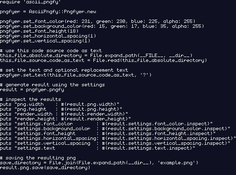

#### What is AsciiPngfy

---

AsciiPngfy is a Ruby Gem that enables you to render ASCII character text into a PNG image using a 5x9 monospaced font. 

The Gem can be configured to change the result using the following settings:

- **font-color**: RGBA color for the font pixels
- **image background-color**: RGBA color for the image background
- **font height**: determines the target render size and does not influence the actual generated image
- **horizontal-spacing**: number of empty horizontal character cells between characters
- **vertical-spacing**: number of empty vertical character cells between lines
- **text and replacement text**: text to render into the generated image and optional replacement text that replaces unsupported characters in the text


Here an example of AsciiPngfy in action, where the source code itself is used as text:

```ruby
require 'ascii_pngfy'

pngfyer = AsciiPngfy::Pngfyer.new

pngfyer.set_font_color(red: 231, green: 230, blue: 225, alpha: 255)
pngfyer.set_background_color(red: 15, green: 17, blue: 35, alpha: 255)
pngfyer.set_font_height(18)
pngfyer.set_horizontal_spacing(1)
pngfyer.set_vertical_spacing(1)

# use this code source code as text
this_file_absolute_directory = File.expand_path(__FILE__, __dir__)
this_file_source_code_as_text = File.read(this_file_absolute_directory)

# set the text and optional replacement text
pngfyer.set_text(this_file_source_code_as_text, '?')

# generate result using the settings
result = pngfyer.pngfy

# inspect the results
puts "png.width    : #{result.png.width}"
puts "png.height   : #{result.png.height}"
puts "render width : #{result.render_width}"
puts "render height: #{result.render_height}"
puts "settings.font_color        : #{result.settings.font_color.inspect}"
puts "settings.background.color  : #{result.settings.background_color.inspect}"
puts "settings.font_height       : #{result.settings.font_height.inspect}"
puts "settings.horizontal_spacing: #{result.settings.horizontal_spacing.inspect}"
puts "settings.vertical_spacing  : #{result.settings.vertical_spacing.inspect}"
puts "settings.text              : #{result.settings.text.inspect}"

# saving the resulting png
save_directory = File.join(File.expand_path(__dir__), 'example.png')
result.png.save(save_directory)

```


Generated `result.png`:



<images>

- 
- what it is as gem
- portfolio project


#### Inspiration and Credit(s)

---

- Monogram


#### Installation

---

- how to install


#### Basic Usage

---


- usage examples with most important points
- extended usage with return values etc


#### How it works

---


#### Issues

---


#### What needs to change

---


#### Feature ideas

---


